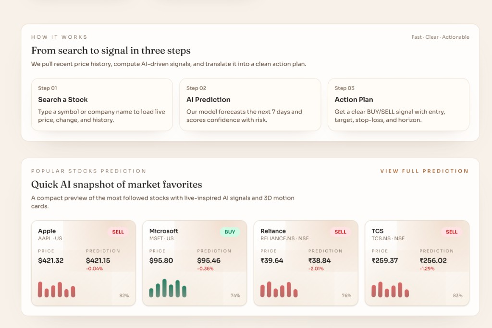
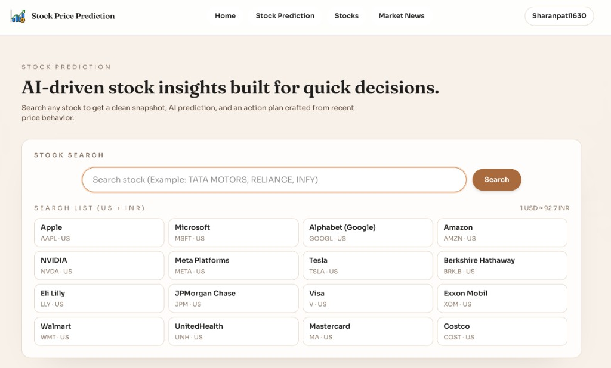
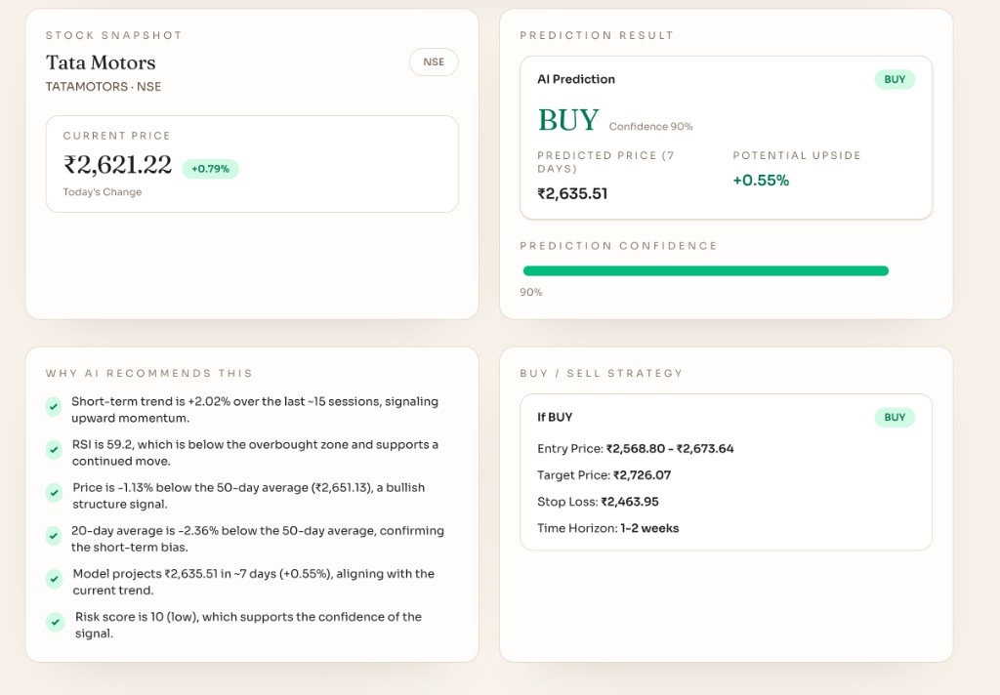

## Stock Price Prediction Platform

<div align="center">

**End‑to‑end ML-powered stock prediction dashboard**

[](https://www.docker.com/)
[](https://fastapi.tiangolo.com/)
[](https://nextjs.org/)
[](#)

</div>

---

### Overview

- **Backend**: FastAPI with ML models (e.g. LSTM) exposed via typed REST APIs
- **Frontend**: Next.js/React trading-style dashboard for charts, predictions, and market views
- **Infrastructure**: Docker + `docker-compose`, Nginx gateway, and Makefile helpers for a smooth DX

This repository is designed as a **professional, production‑ready template** for time‑series / stock‑prediction projects, with clear separation between backend, frontend, and infrastructure.

---

### Tech Stack At A Glance

| Layer          | Technologies                                |
| ------------- | ------------------------------------------- |
| **Frontend**  | Next.js, React, TypeScript, modern UI/UX   |
| **Backend**   | FastAPI, Python, ML (e.g. LSTM)             |
| **Data**      | Finnhub, Alpha Vantage, local JSON fallback |
| **Infra/Tooling** | Docker, docker-compose, Nginx, Makefile |

---

### Features

- **Machine Learning powered predictions**
  - LSTM-based model for stock price forecasting
  - Inference service exposed via REST API
- **Data integrations**
  - Finnhub and Alpha Vantage market data support
  - Simple local JSON data for demo/testing
- **Full-stack app**
  - API server (FastAPI) with typed routes and OpenAPI docs
  - Next.js UI for viewing prices, predictions, and portfolio
- **Dockerized setup**
  - Single command to run the entire stack
  - Nginx reverse proxy / gateway

---

### Screenshots

<div align="center">

**Landing & How It Works**



**Stock Search & Popular Stocks**



**Prediction Detail & Strategy**



</div>

---

### Project Structure

```text
.
├── backend/           # FastAPI app, ML models, services
├── frontend/          # Next.js web UI
├── nginx/             # Nginx config and gateway
├── data/              # Sample/local data (non-sensitive)
├── docker-compose.yml # Orchestration for all services
├── Makefile           # Helpful dev/ops commands
└── README.md
```

---

### Prerequisites

- **Docker Desktop** (or compatible Docker engine)
- **Make** (optional but recommended)
- **API keys**:
  - Finnhub API key
  - Alpha Vantage API key

---

### Quick Start (Docker)

1. **Clone the repository**

```bash
git clone https://github.com/Sharan0555/Stock-Price-Prediction.git
cd Stock-Price-Prediction
```

2. **Create a `.env` file in the project root**

```bash
cp .env.example .env
```

3. **Configure environment variables**

Edit `.env` and set at least:

```text
FINNHUB_API_KEY=your_finnhub_key_here
ALPHAVANTAGE_API_KEY=your_alphavantage_key_here
```

4. **Start the full stack**

Using Docker directly:

```bash
docker compose up --build
```

Or with `make`:

```bash
make up
```

---

### Faster Startup After First Build

Once images are built successfully, you can start without rebuilding:

```bash
make up-fast
```

Run in background (detached):

```bash
make up-d
```

To stop containers:

```bash
docker compose down
```

Or:

```bash
make down
```

---

### Services & URLs

Once the stack is running:

- **Gateway / Web app**: `http://127.0.0.1`
- **Backend docs (via gateway)**: `http://127.0.0.1/api/docs`
- **Example FX endpoint (via gateway)**:  
  `http://127.0.0.1/api/v1/stocks/fx/inr?base=USD`

---

### Local Development (Optional)

If you prefer to run services locally without Docker:

- **Backend** (example flow):

```bash
cd backend
python -m venv .venv
source .venv/bin/activate  # or .venv\Scripts\activate on Windows
pip install -r requirements.txt
uvicorn app.main:app --reload
```

- **Frontend** (example flow):

```bash
cd frontend
npm install
npm run dev
```

Then visit `http://localhost:3000`.

---

### Tests

Backend tests (example with `pytest`):

```bash
cd backend
pytest
```

---

### Contributing

Contributions, issues, and feature requests are welcome!

1. Fork the repo
2. Create a feature branch: `git checkout -b feature/my-feature`
3. Commit your changes: `git commit -m "feat: add my feature"`
4. Push the branch: `git push origin feature/my-feature`
5. Open a Pull Request on GitHub

---

### License

This project is currently **unlicensed**.  
If you plan to make it open source, consider adding a license file (e.g. MIT) at the repository root.

